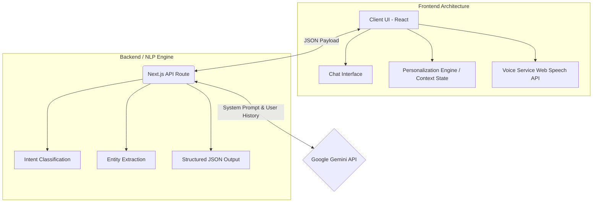

# VoteMate Architecture

VoteMate is built on a modern, decoupled architecture using **Next.js (App Router)** as the full-stack framework and **Google Gemini** as the core intelligence engine. The architecture is explicitly designed to handle Natural Language Processing (NLP) and entity extraction to drive a dynamic UI.

## High-Level Diagram

## 1. Frontend (Client-Side)
Located primarily in `src/app/page.tsx` and `src/app/page.module.css`, the frontend is a React Server Component transformed into a Client Component (`'use client'`) to handle complex interactive state.

- **State Management:** The frontend maintains several distinct slices of state:
  - `messages`: The raw chat history (User vs Model).
  - `userContext`: The extracted entities (`age`, `location`, `isRegistered`) used to render the Voter Profile Dashboard.
  - `timeline`: A dynamic array of deadline objects rendered visually.
  - `quickReplies`: Contextual buttons generated by the AI on the fly.
- **Voice Integration:** Utilizes native browser APIs (`window.SpeechRecognition` and `window.speechSynthesis`) to handle voice-to-text and text-to-voice without requiring heavy third-party SDKs.

## 2. Backend API Route (Next.js Edge)
Located in `src/app/api/chat/route.ts`, this route acts as the secure middleman between the client and the Google GenAI SDK. 

- **Security:** The `GEMINI_API_KEY` is securely stored on the server and never exposed to the client.
- **Context Injection:** When the frontend makes a POST request, it passes not just the message history, but the *current known user context*. The backend injects this into the system prompt behind the scenes to ensure the AI never forgets what it already knows.

## 3. NLP & Intelligence Engine (Google Gemini)
The true architectural innovation lies in how the Gemini API is utilized. Instead of using Gemini for simple string generation, we use **Structured Outputs (JSON Schema)**.

The API is forced to return a JSON object containing:
- `response`: The natural language answer.
- `intent`: Classified intent of the user.
- `userContext`: Extracted entities from the current message.
- `timelineHighlights`: Structured deadline data.
- `currentStepId`: State machine progression (1 to 5).

This transforms the LLM into a deterministic NLP engine that controls the frontend's visual state directly.
